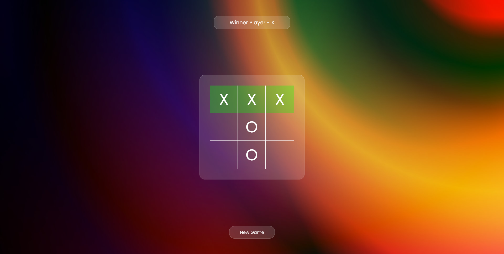

## React Tic Tac Toe

Visit live <a href='https://manish03singh.github.io/TicTacToe/' target='_blank'>website</a>

Welcome to React Tic Tac Toe - a simple web application where two players can engage in a classic game of Tic Tac Toe.

# Usage

Enter the names of the two players.

Click on the cells of the grid to make your moves.

The game will automatically determine the winner or declare a draw.

Enjoy playing Tic Tac Toe with a friend!

 

Visit me on <a href='https://www.linkedin.com/in/manish-kumar-singh-12a28a190/' target='_blank'>linkedin</a> and <a href='https://twitter.com/Manish_03_Singh' target='_blank'>twitter</a>
